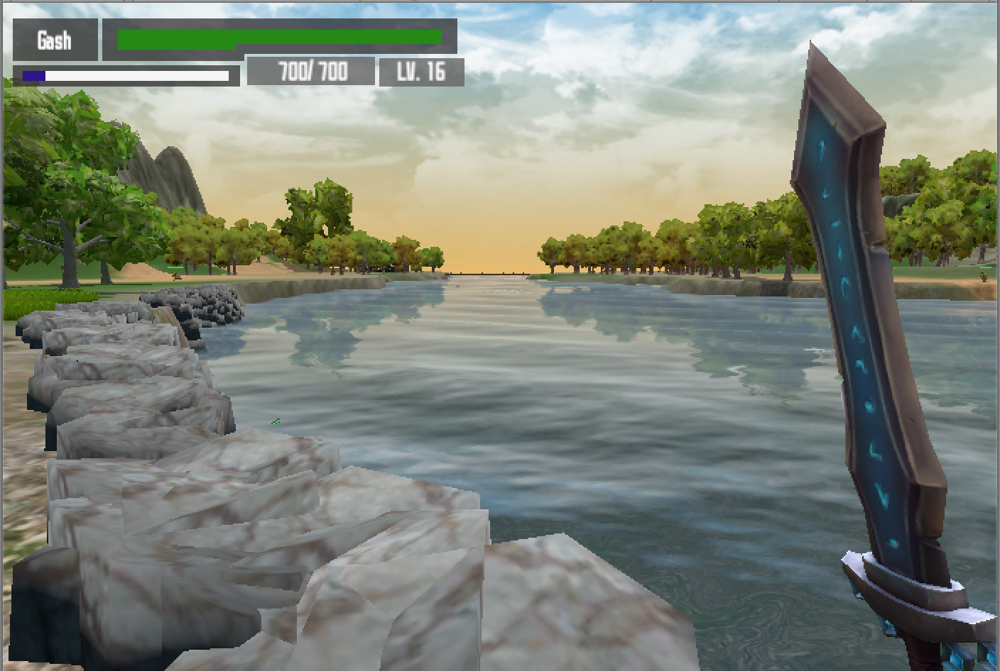
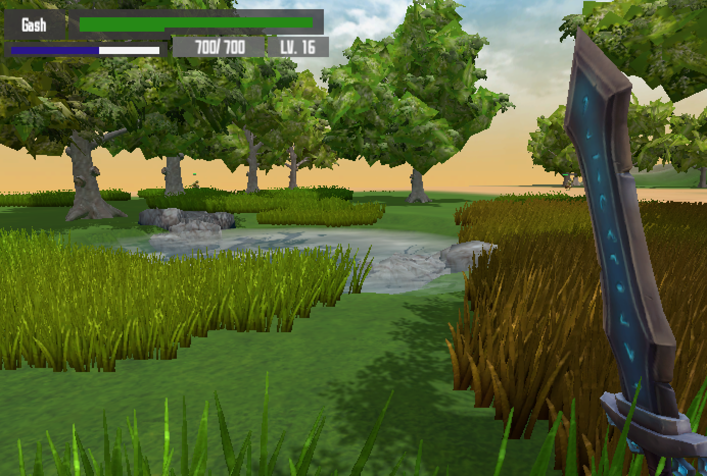
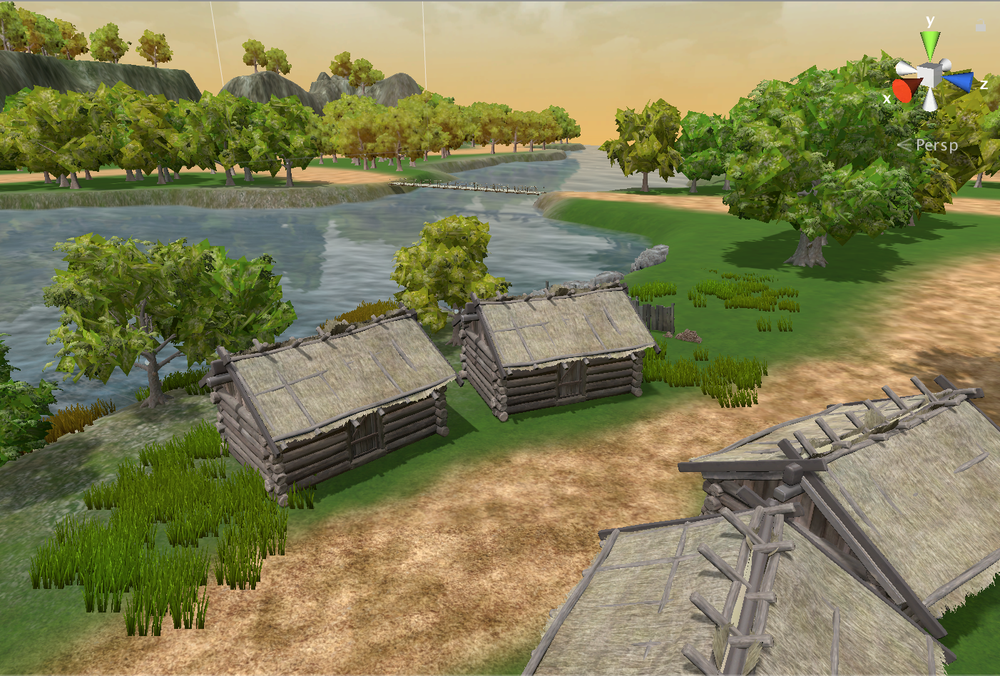
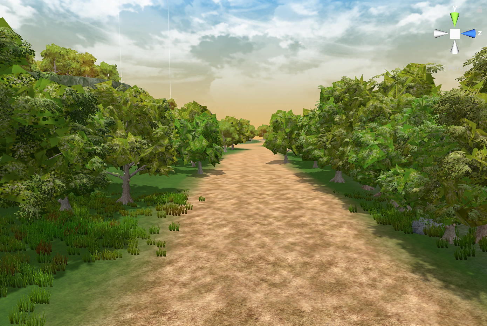

# fictional-succotash

A fictional fantasy RPG. 

You begin as a rogue warrior named Gash, on a mission to cleanse the land of evil.

Created with Unity Engine.

## Disclaimer

I'm a noob game developer so everything is really messy.
Honestly not even sure if my classes/objects are set up correctly.
The game itself feels out of proportion (character too large, enemies too small, structures too small).

## Gameplay

W, A, S, D for movement.

Left click to attack.

Shift to run.

Health bar decreases when hit.

Stamina drains when running or attacking. Player cannot run or attack when the stamina completely depletes, until it replenishes back to full.
Stamina will replenish when player is out of combat at a fairly quick pace.

## Screenshots

  
  
  
  

## Special Thanks

Greatsword of Frozen Night v1 - ZugZug Art

Standard Assets 1.1.2 - Unity Technologies

Viking Village 1.0.1772 - Unity Technologies

Rock and Boulders 2 1.1 - Manufactura K4

Nature Starter Kit 2 1.0 - Shapes

Modular Wooden Bridge Tiles 1.1 - Laxer

Thank you to all the free assets from the Unity Asset Store.
